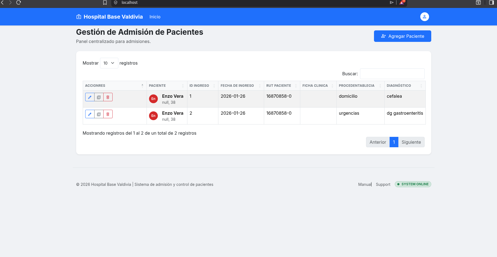

# Sistema de Gestión de Ingresos de Pacientes

Un sistema web para la gestión de ingresos de pacientes en el servicio de medicina de un hospital. Desarrollado con PHP, con base de datos MySQL y interfaz moderna con Bootstrap 5.

## 🚀 Características

- **Gestión de Ingresos**: Registro y consulta de ingresos de pacientes
- **API REST**: Endpoints para integración con otros sistemas
- **Interfaz Moderna**: Dashboard responsivo con Bootstrap 5 y Material Symbols
- **Base de Datos**: MySQL con estructura optimizada para datos médicos
- **Arquitectura MVC**: Separación clara de responsabilidades
-

## 🛠️ Tecnologías Utilizadas

- **Backend**: PHP 8.1+
- **Base de Datos**: MySQL 8.0
- **Frontend**: HTML5, CSS3, JavaScript
- **Framework CSS**: Bootstrap 5.3
- **Iconos**: Material Symbols

## 📋 Requisitos

- PHP 8.1+ con extensiones PDO 
- MySQL 8.0+
- Git

## 🚀 Instalación y Configuración

### 1. Clonar el Repositorio

```bash
git clone <url-del-repositorio>
cd test_hbv
```

### 2. Configurar la Base de Datos

Asegúrate de que MySQL esté corriendo localmente. Ejecuta el script de base de datos:

```bash
mysql -u root -p < db.sql
```

### 3. Configurar Usuarios de Base de Datos

Crea el usuario de la aplicación en MySQL:

```bash
mysql -u root -p -e "
CREATE DATABASE IF NOT EXISTS ingreso_pacientes_db;
CREATE USER 'ingreso_user'@'localhost' IDENTIFIED BY 'ingreso_pass';
GRANT ALL PRIVILEGES ON ingreso_pacientes_db.* TO 'ingreso_user'@'localhost';
FLUSH PRIVILEGES;
"
```


## 📁 Estructura del Proyecto

```
test_hbv/
├── app/                          # Código de la aplicación
│   ├── Bootstrap/
│   │   └── app.php              # Inicialización de la aplicación
│   ├── Controllers/             # Controladores MVC
│   │   ├── Api/
│   │   │   └── IngresoController.php
│   │   └── Web/
│   │       └── HomeController.php
│   ├── Core/                    # Núcleo del framework
│   │   ├── Database.php         # Conexión a base de datos
│   │   ├── Request.php          # Manejo de peticiones HTTP
│   │   ├── Response.php         # Manejo de respuestas HTTP
│   │   └── Router.php           # Enrutamiento
│   ├── Repositories/            # Capa de acceso a datos
│   │   └── IngresoRepository.php
│   ├── Services/                # Lógica de negocio
│   │   └── IngresoService.php
│   ├── Views/                   # Plantillas de vista
│   │   ├── home.php
│   │   └── layouts/
│   │       └── main.php
│   └── routes/                  # Definición de rutas
│        └── routes.php
├── public/                      # Archivos públicos
│   ├── index.php               # Punto de entrada
│   └── assets/                 # CSS, JS, imágenes
│       ├── css/
│       ├── js/
│       └── fonts/
├── db.sql                      # Script de base de datos
└── README.md                   # Este archivo
```

## 🔌 Endpoints de la API

### Ingresos de Pacientes

- **GET /ingresos**: Lista todos los ingresos
- **GET /ingresos/{id}**: Obtiene un ingreso específico
- **POST /ingresos/** : Crea un ingreso


## 🎨 Interfaz de Usuario

La aplicación incluye:

- **Vista de Ingresos**: Tabla interactiva con filtros y paginación


## 📝 Licencia

Este proyecto está bajo la Licencia MIT. Consulta el archivo `LICENSE` para más detalles.

## TODO

- validaciones de datos en js y php
- corecciones de intefaz grafica formulario


## Capturas de pantallas




## Pruebas 


```bash
curl -k -X POST https://localhost/ingresos \
  -H "Content-Type: application/json" \
  -H "Accept: application/json" \
  --data-raw '{"nombre":"trinidad huirican","run":"24378542-1","edad":12,"fecha_nacimiento":"2013-09-24","fecha_ingreso":"2026-01-26","hora_ingreso":"19:10","ficha":"123456","procedencia":"ap pediatrica","diagnostico":"dg fx de radio derecho","fc":90,"fr":"25","pa":"120/80","tax":37,"sato2":100,"fio2":null,"hgt_sv":90,"eva":8,"peso":45,"talla":150,"anamnesis":"fx radio derecha por caida de nivel de litera ","conciencia":"CONCIENTE","com_verbal":"COMPLETA COHERENTE","alt_sensorial":"LENTES","boca":"SANA","pupilas":"ISOCORIA","observaciones_comunicacion":null,"via_aeria":false,"respiracion":"POLIPNEA","oxigenoterapia":"BIGOTERA","tos":"AUSENTE","color_piel":"","secrecion":"","observaciones_oxigenacion":"polipnea por dolor ","estado_nutricional":"NORMAL","alimentacion":"SOLO","apetito":"BUENO","piel_mucosas":"HIDRATADA","abdomen":true,"abdome":false,"otra":"","observaciones_nutricion":null,"intestinal":"","urinaria":"","patron_sueno":"NORMAL","vestrise_desvestrise":"AUTONOMO","aprendizaje":"LECTURA","observaciones_eliminacion":null,"solicita_servicios_religiosos":0,"actividad":"MOVILIZA SOLO","inmovilizacion":"","fuerza_muscular":"DISMINUIDA","sensibilidad":"AUMENTADA","observaciones_movilizacion":"se observa fractura con lesion en extremidad superior derecha ","higiene":"ASEADO","estado_piel":"INTEGRA/HIDRATADA","heridas":true,"caracteristicas_heridas":true,"vendaje_heridas":true,"observaciones_higiene":"paciente llega desde su casa cubriendo herida con toalla","habitos":"","frecuencia_habitos":"","alergias":"","estado_temperancia":"SOBRIO","vacunas":"","ant_morbidos":true,"observaciones_seguridad":"alergia a la aspirina","estado_termorregulacion":"NORMAL","observaciones_termorregulacion":null,"situacion_laboral":"TRABAJA","estado_animico":"TRISTE/DEPRESION","red_apoyo":"VIVE CON FAMILIA","acompanamiento":"CUIDADOR","observaciones_realizacion_personal":null,"tet":0,"tet_altura":null,"tet_fecha":null,"s_foley":0,"s_foley_fecha":null,"sng_sny":0,"sng_sny_fecha":null,"cvc":0,"cvc_fecha":null,"vvp_adm":1,"vvp_fecha":null,"descripcion_soluciones_administradas":"se adm s fisiologico 0.9% de 500 ml con ketorolaco 30 mg ev ","pertenencias":"mochila ","monitor_cardiaco":1,"smpt":0,"hemograma":1,"ecg":0,"tt":0,"csv":1,"sonda_foley":0,"pbq_ck":1,"rx_torax":0,"mmv":0,"examen_fisico":1,"sng":0,"ttpa":1,"linea_arterial":0,"naricera":0,"vvp_ingreso":1,"intubacion":0,"gsa_gsv":0,"eco":0,"hgt":0,"vvc":0,"vmi_vmni":0,"hemocultivo":0,"tac":1,"nombre_enfermero":"paulina vega","codigo_enfermero":"h39","fecha_termino":"2026-01-26","hora_termino":"19:35","observaciones_finales":"se traslada a  tmt infantil post toma de rx por indicacion medica"}'

  ```
